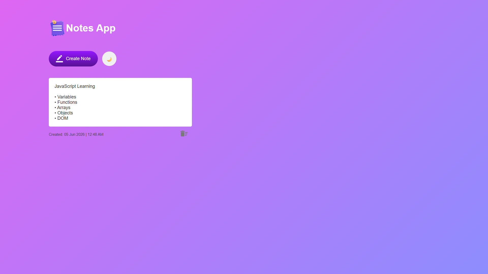
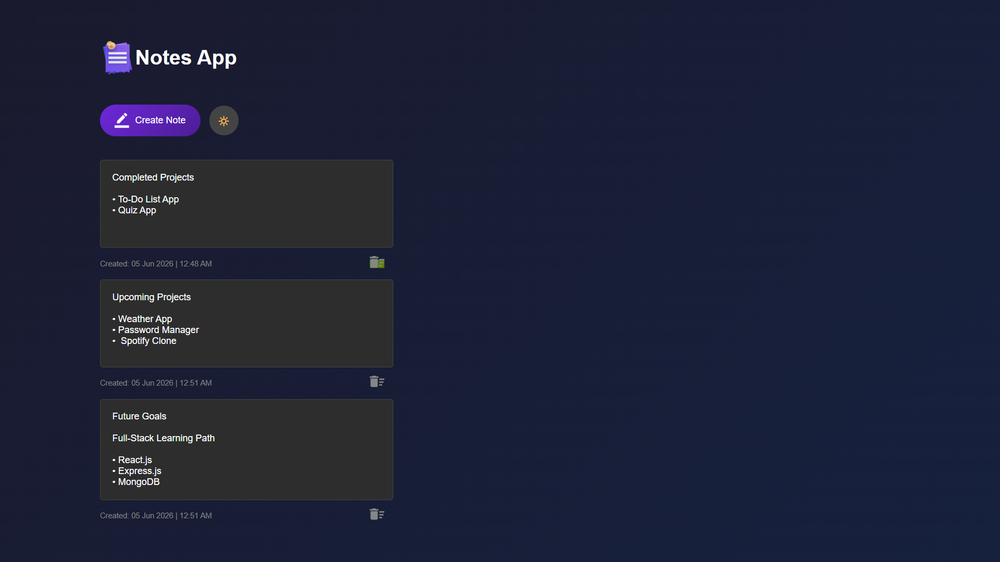

# 📝 Notes App

A responsive Notes App built using HTML, CSS, and JavaScript that allows users to create, edit, delete, and save notes using Local Storage. The application also includes a Dark/Light Theme Toggle and automatic note creation timestamps for a better user experience.

---

## 🚀 Features

* Create new notes instantly
* Edit notes directly inside the app
* Delete notes easily
* Save notes using Local Storage
* Notes remain available after page refresh
* Dark / Light Theme Toggle
* Automatic Created Date & Time for every note
* Responsive design for different screen sizes
* Clean and user-friendly interface

---

## 🛠️ Technologies Used

* HTML5
* CSS3
* JavaScript
* DOM Manipulation
* Local Storage

---

## 📸 Project Preview

### Writing and Editing Notes (Light Theme)



### Managing Multiple Notes (Dark Theme)



---

## 📂 Project Structure

```text
Notes-App/
│
├── index.html
├── style.css
├── script.js
│
└── Images/
    ├── delete.png
    ├── edit.png
    ├── notes.png
    ├── notes-writing-content.png
    └── notes-multiple-notes-dark-theme.png
```

---

## 💡 What I Learned From This Project

While building this project, I learned:

* DOM Manipulation
* Dynamic Element Creation
* Event Handling
* Local Storage
* Data Persistence
* Content Editable Elements
* Theme Toggling
* Date & Time Handling
* Parent-Child Relationships
* Sibling Elements
* CSS Positioning
* Responsive Design Basics
* Debugging JavaScript and UI Issues

---

## 🎯 Future Improvements

* Search Notes Feature
* Note Categories
* Note Pinning
* Export Notes Option
* Better Animations
* Rich Text Formatting

---

## 👨‍💻 Author

**Mohammed Naeem Patel**

GitHub:
https://github.com/Mohammed-Naeem-Patel

---

## ⭐ Note

This project was created for practice and learning JavaScript concepts through a real-world Notes Application.

In addition to the core Notes App functionality, I enhanced the project by implementing a Dark/Light Theme Toggle, automatic note timestamps, improved note structure, and a better user experience.

This project helped me strengthen my understanding of DOM Manipulation, Local Storage, Dynamic Element Creation, Event Handling, Theme Toggling, Date & Time Handling, and Frontend Development concepts.
